# Capstone Project
## Machine Learning Engineer Nanodegree
Rafael Castillo Alcibar

September 15th, 2016

## I. Definition

### Project Overview

This project is a proof of concept (POC) solution where deep learning techniques are applied to vehicle recognition tasks, this is particularly important task in the area of traffic control and management, for example, companies operating road tolls to detect fraud actions since different fees are applied with regards to vehicle types. Images used to train neural nets are obtained from the [Imagenet](http://image-net.org/) dataset, which publicly distributes images URLs for hundreds of categories. Since the whole experiment is performed on a personal computer with limited computational resources, POC scope is also limited to the simple classification of two different kinds of vehicles: Trailer Trucks versus Sports Cars. Main POC's goal is to determine the maximum accuracy (percent of times model was correct on its predictions) different neural nets with basic architectures can reach using a limited set of images (less than 700) for training.

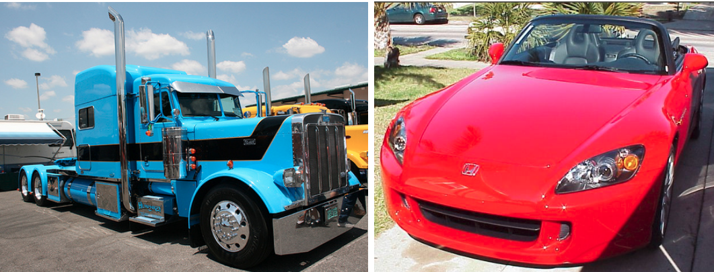

 The whole project is constructed using [Keras](https://github.com/fchollet/keras), which is a highly modular neural networks library, written in Python and capable of running on top of either TensorFlow or Theano and it was developed with a focus on enabling fast experimentation. In this case, Theano is the backend selected.

#### Some Deep Learning Background
The first general, working learning algorithm for supervised deep feedforward multilayer perceptrons was published by Ivakhnenko and Lapa in 1965.  In 1989, Yann LeCun et al. were able to apply the standard backpropagation algorithm, which had been around as the reverse mode of automatic differentiation since 1970 to a deep neural network with the purpose of recognizing handwritten ZIP codes on mail. Despite the success of applying the algorithm, the time to train the network on this dataset was approximately 3 days, making it impractical for general use. According to LeCun, in the early 2000s, in an industrial application CNNs already processed an estimated 10% to 20% of all the checks written in the US in the early 2000s. The significant additional impact of deep learning in image or object recognition was felt in the years 2011–2012. Although CNNs trained by backpropagation had been around for decades, fast implementations of CNNs with max-pooling on GPUs  were needed to make a dent in computer vision. In 2011, this approach achieved for the first time superhuman performance in a visual pattern recognition contest.

Deep learning is often presented as a step towards realizing strong AI and thus many organizations have become interested in its use for particular applications. In December 2013, Facebook hired Yann LeCun to head its new artificial intelligence (AI) lab. The AI lab will develop deep learning techniques to help Facebook do tasks such as automatically tagging uploaded pictures with the names of the people in them.

In 2014, Google also bought DeepMind Technologies, a British start-up that developed a system capable of learning how to play Atari video games using only raw pixels as data input. In 2015 they demonstrated AlphaGo system which achieved one of the long-standing "grand challenges" of AI by learning the game of Go well enough to beat a human professional Go player. [ref 04]


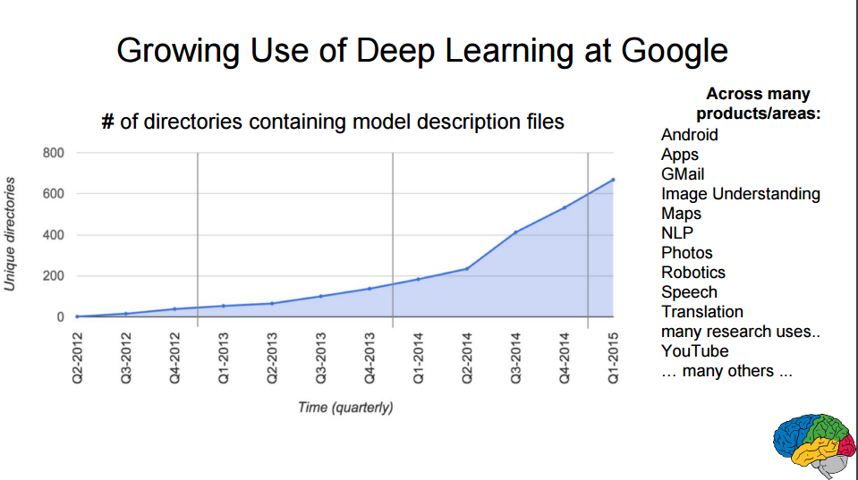


### Problem Statement

For this project, it is used a personal computer (Intel® Core™ i5-4310M CPU @ 2.70GHz × 4, 8 Gb RAM and 64-bit). Different deep learning models are trained and validated and their results compared in order to determine which architecture maximizes prediction scores in the vehicle classification recognition while minimizing computational costs. Vehicles images will be used to train and test models while a subset of images are used for validation (these are unseen images for models not previously used during the train/test phase).

### Metrics

Since this is a binary classification problem, basically model will try to respond to the question: "Is the vehicle of this picture a trailer truck or a sports car?", scores like Precision, Recall, F-Scores or Accuracy are suitable. For simplicity, and since the dataset is balanced (there are a similar number of images for each class), accuracy is the score used to evaluate models performances. Accuracy gives an estimate of how an often model is correct on its predictions, that is, how often model correctly flags a truck like a truck and a sports car as a sports car.

In the other hand, since computational resources is also a critical point to consider, minutes required to train the model is the second metric used. Combination of both scores allows the identification of the model that maximizes precision while minimizing computational resources.


## II. Analysis

### Data Exploration

Images are collected from Imagenet dataset which contains hundreds of different categories, [synsets](https://en.wikipedia.org/wiki/WordNet) is used to identify any particular category, for example, in this particular case the following synsets are used:

 1. n04467665: Trailer Trucks
 2. n04285008: Sport-Cars

To retrieve images, since image URLs are freely available, the process to download by HTTP protocol requires a little python script to download pictures from urls listed in the following link:
```
http://www.image-net.org/api/text/imagenet.synset.geturls?wnid=[wnid]
````

where ```[wnid]``` is one of the synsets selected previously. For further reference, please check [Imagenet documentation](http://image-net.org/download-imageurls).


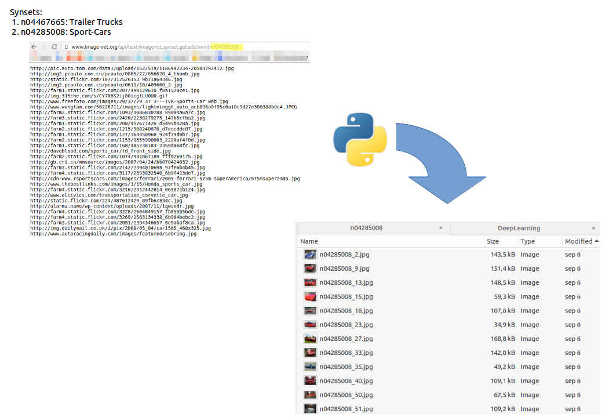

Image below summarizes main dataset characteristics, a total of 1550 pictures are available with a mean height and width of 352 and 483 pixels respectively with 3 channels (RGB) for colors. Since there are pictures with 1px height and width, pictures with less than 150px for each dimension are removed since are considered to not be valid for the project due to their poor resolution,this process eliminated just 32 images. 

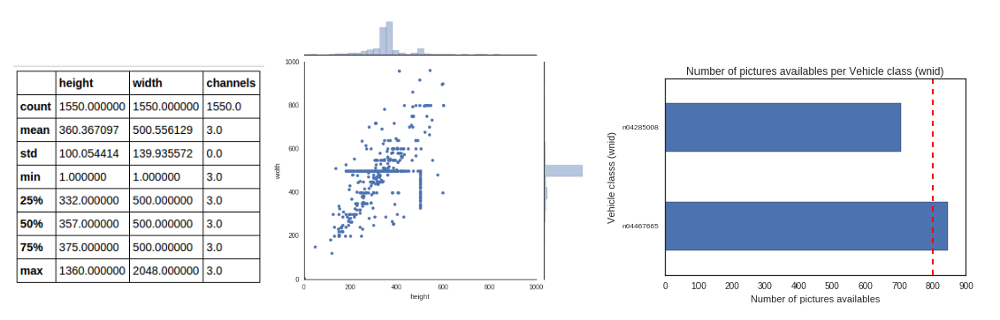

With regards of the different classes, just one of them include more than 800 pictures, since the dataset is at this stage umbalanced and small, [Keras Data Generator](https://keras.io/preprocessing/image/) utility is employed to generate fake images from the pictures already available, for example, the picture below. This utility is crucial to balance classes and generate new images to train models [ref 05].


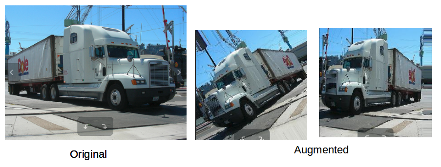

### Exploratory Visualization

In order to use images as input for the deep learning models, images need to be converted into multidimensional arrays of number where each pixel represents a cell in the multidimensional array. For this process it is used the Numpy library ```ndimage``` as described in this [tutorial](http://www.scipy-lectures.org/advanced/image_processing/). In this project images are resized to 150px height and width respectively in gray scale of colors (since color is not a determinant characteristic to differentiate between a truck and a sports car) which reduces dimensions in two dimensions (RGB = 3 channels, grayscale = 1 channel)

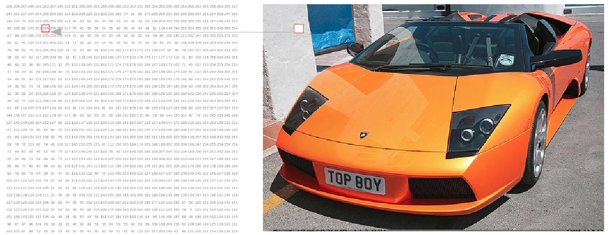

### Algorithms and Techniques

Different deep convolutional neural nets architectures are used to perform this task, which nowadays seems to be the best known approach in the image recognition field. Images categorization is a complex task, for example, a grayscale image of size 150x150 would be transformed to a vector of size 150·150 = 22500 for a fully connected neural network. Such huge dimensionality with no predefined features makes this problem unapproachable for standard supervised learning approaches, even combining them with dimensional reduction techniques like PCA. 

Convolutional nets are elected to be the most efficient technique to extract relevant information from, in this case, images to be used in classification tasks. When used for image recognition, convolutional neural networks (CNNs) consist of multiple layers of small kernels which process portions of the input image, called receptive fields. [This blog by Victor Powell](http://setosa.io/ev/image-kernels/) is an excellent resource to understand how kernels works. The outputs of these kernels are then tiled so that their input regions overlap, to obtain a better representation of the original image; this is repeated for every such layer. Convolutional networks may include local or global pooling layers, which combine the outputs of neuron clusters. Compared to other image classification algorithms, convolutional neural networks use relatively little pre-processing. This means that the network is responsible for learning the filters that in traditional algorithms were hand-engineered. The lack of dependence on prior knowledge and human effort in designing features is a major advantage for CNNs.

Another important concept of CNNs is pooling, which is a form of non-linear down-sampling. There are several non-linear functions to implement pooling among which max pooling is the most common. It partitions the input image into a set of non-overlapping rectangles and, for each such sub-region, outputs the maximum. The intuition is that once a feature has been found, its exact location isn't as important as its rough location relative to other features. The function of the pooling layer is to progressively reduce the spatial size of the representation to reduce the amount of parameters and computation in the network, and hence to also control overfitting. It is common to periodically insert a pooling layer in-between successive conv layers in a CNN architecture. The pooling operation provides a form of translation invariance.[ref 06].

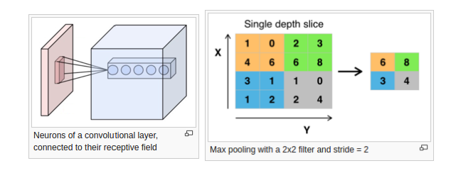

The proposed net architecture for this particular problem is a neural net with 1 to 4 layers where each layer includes a CNN + Max Pooling layer. On top of that it is included a fully connected net with 150 nodes in the input side and 1 node to output results and dropout implemented. Dropout is a regularization technique for reducing overfitting in neural networks by preventing complex co-adaptations on training data, it basically consist in dropping out nodes randomly in a neural network to gain robustness in model predictions. Below is included an example of a proposed architecture:

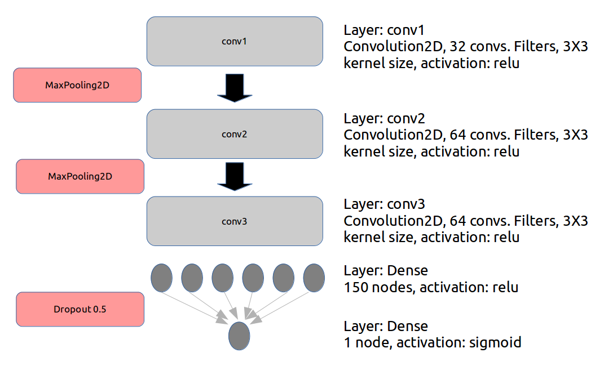


### Benchmark

In the study: [Monza: Image Classification of Vehicle Make and Model Using Convolutional Neural Networks and Transfer Learning](http://cs231n.stanford.edu/reports/lediurfinal.pdf) several machine learning approaches are used for car detection and identification. A fine-grained dataset containing 196 different classes of cars is employed. This dataset is particularly challenging due to the freeform nature of the images, which contained cars in many different sizes, shapes, and poses, similar scenario applies to the current dataset, but in this particular case there are just two different classes. Study results are presented in terms of accuracy for the top1 and top5 classes for the different approaches used. For the Deep Learning approaches, accuracy values are around 0.8, so this will be the value used to benchmark current results.

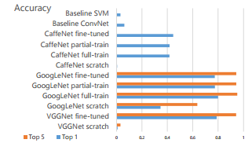

## III. Methodology

### Data Preprocessing

Vehicles images are downloaded from the Imagenet dataset, in the notebook included is described the process step-by-step, basically it is required to include the configuration parameters in ```configuration.py``` and execute ```download_imagenet_images.py```. 

Once all files are downloaded, different picture classes needs to be organized following the structure:
```
dataset\
    train\
        n04467665\
            n04467665_01.png
            n04467665_04.png
            ...
        n04285008\
            n04285008_01.png
            n04285008_04.png
            ...
    test\
        n04467665\
            n04467665_02.png
            n04467665_03.png
            ...
        n04285008\
            n04285008_02.png
            n04285008_03.png
            ...    
    validation\
        n04467665\
            n04467665_07.png
            n04467665_09.png
            ...   
        n04285008\
            n04285008_07.png
            n04285008_09.png
            ...
```

For this purpose, ```Data_Wrangling.py``` is employed. Next step is to eliminate those pictures with height and width lower than 150px. A threshold of 150px is employed since this is the images dimensions used in common Deep Learning models nowadays and the size of the input images for the models. To end, ```ImageProcessor.py``` is employed to perform several tasks:
 1. Generate augmented images from current images using the Keras utility ImageDataGenerator to be used to train models.
  - rescale=1./255: as the images taken by Raspberry Pi’s camera come with RGB coefficients in the range of 0-255 I had to normalize the values to span from 0 to 1., which was achieved by this scaling
  - rotation_range=40: images were rotated randomly by 0-40 degrees
  - width_shift_range=0.01: range in which image was randomly translated vertically
  - height_shift_range=0.1: range in which image was randomly translated horizontally
  - shear_range=0.05: range in which shearing transformations were applied randomly
  - zoom_range=0.1: range in which image was zoomed at randomly
  - fill_mode='nearest': this was the method with which newly introduced pixels were filled out
 2. Resize pictures to height and width of 150px.
 3. Use a gray scale for the picture colors (since color is not a important feature to distinguish a truck from a car).

### Implementation

For the implementation I have chosen Keras. Keras is a neural network library for Theano and TensorFlow written in Python. Different convolutional neural net architectures were applied for the task with the intention of identifying the architecture that reached a reasonable accuracy with the minimum computational resources. Networks consisted of an input layer, 1 to 4 convolutional layers, a fully connected layer, and an output layer. The convolutional layers used 3x3 convolutions and 32-64 output filters followed by max pooling layers of 2x2. For the activation functions rectified linear units are used, except for the final output neuron which was sigmoid. After the fully connected layer a dropout of 0.5 was applied (this helps to prevent overfitting). For the loss function I have used logloss (binary crossentropy). Two different optimizers are used and compared: ```adam``` and ```Adagrad```.

With regards to the difficulties encountered in the process, the first difficulty was to understand how data augmentation should be carried out. It needed a bit of trial and error to figure out how much I can distort the images, such that the car/truck remains on the images all the time.
A further difficult was to figure out how to visualize the filters. Although I had a [solution to start from](https://keras.io/getting-started/faq/#how-can-i-record-the-training-validation-loss-accuracy-at-each-epoch), the code needed some workaround, such as referencing my convolutional layers, writing a function to draw the images for all filters.


### Refinement

Nets with 1 to 4 layers are tested in order to determine which configuration provides the best performance while minimizing computational resources. In the picture below it is demonstrate nets performance in terms of accuracy and minutes to train for the different layers and optimized used:

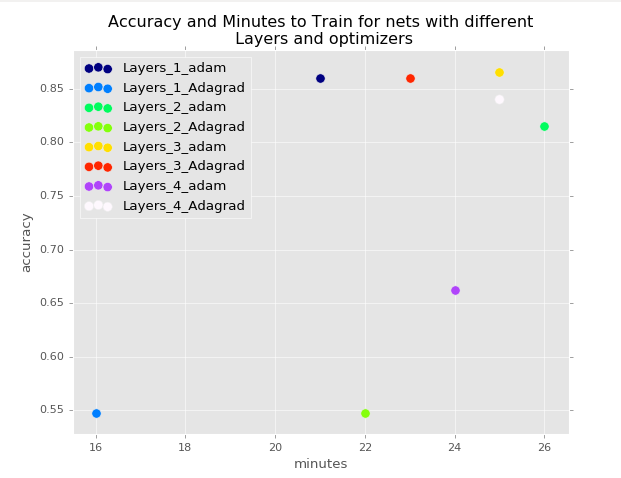

| Net Architecture   |      Accuracy      |  Minutes to train |
|----------|:-------------:|------:|
| Layers_1_adam |  0.86 | 21 |
| Layers_1_Adagrad |    0.55   |   16 |
| Layers_2_adam | 0.81 |    26 |
| Layers_2_Adagrad | 0.55 |    22 |
| Layers_3_adam | 0.87 |    25 |
| Layers_3_Adagrad | 0.86 |    23 |
| Layers_4_adam | 0.66 |    24 |
| Layers_4_Adagrad | 0.84 |    25 |


Neural Net with 1 layer and adam optimizer already meet the benchmark criteria, so no need of further refinement is required. Below are the accuracy and loss representation for Layer 1 and adam optimizer:


## IV. Results


### Model Evaluation and Validation

A validation set with a 10% of the dataset, not used during training/testing phase, is used to validate results. The final architecture selected, 1 layer and adam optimizer, reaches an accuracy over 80% which is in the range of the benchmark results. An accuracy of 80% means that model is correct in in 80 out of 100 predictions made. Since the dataset is balanced (thanks to the data augmentation), accuracy is a perfectly valid metric in this scenario and no need to investigate alternatives like Precision & Recall or F-Scores is required.

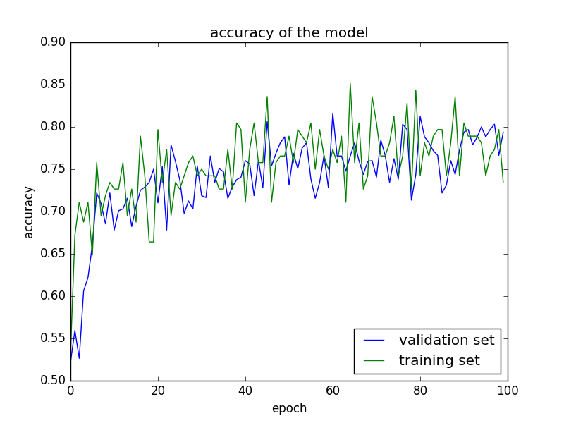

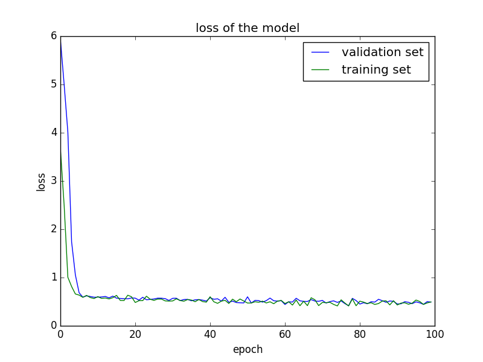

### Justification
In this section, your model’s final solution and its results should be compared to the benchmark you established earlier in the project using some type of statistical analysis. You should also justify whether these results and the solution are significant enough to have solved the problem posed in the project. Questions to ask yourself when writing this section:
- _Are the final results found stronger than the benchmark result reported earlier?_
- _Have you thoroughly analyzed and discussed the final solution?_
- _Is the final solution significant enough to have solved the problem?_

The result obtained with the model selected was higher than actually expected. In a more simplistic approach (just two classes), model is capable to reach state of the art accuracy performances even on the validation set (completely unseen data for the model). We can consider this proof of concept satisfactory as model reaches benchmark results.


## V. Conclusion
_(approx. 1-2 pages)_

### Free-Form Visualization

Following are represented some original pictures and how different filters represent them in the different convolutional layers. This gives us an idea of how the neural net decomposes the
visual space.


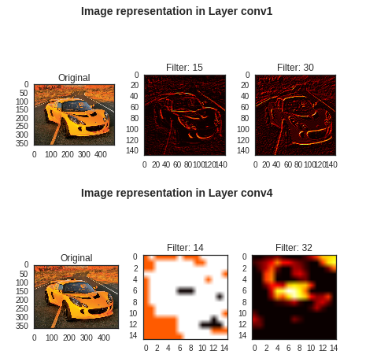

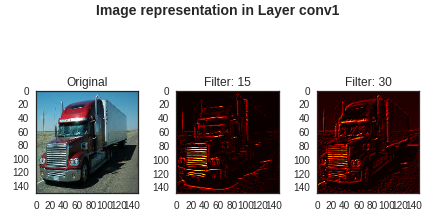 

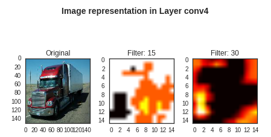

In both examples, for layer 1, different filters focus mainly on shapes and still images are recognizable, but in higher layers this not happens anymore and looks mostly noise. As mentioned by ```@fchollet``` on his expcetional [post](https://blog.keras.io/how-convolutional-neural-networks-see-the-world.html): _"Does it mean that convnets are bad tools? Of course not, they serve their purpose just fine. What it means is that we should refrain from our natural tendency to anthropomorphize them and believe that they "understand", say, the concept of dog, or the appearance of a magpie, just because they are able to classify these objects with high accuracy. They don't, at least not to any any extent that would make sense to us humans."_

### Reflection

In this POC it is implemented a Deep Learning solution to automatic vehicle recognition. Image recognition used to be a difficult task historically, however for the last few years (thanks to augmented computational resources) there are efficient methods to approach these kinds of problems. Deep multi-layer neural networks are capable of building up a hierarchy of abstractions that makes it possible to identify
complex inputs (i.e. images), and in this project this is the approach selected.

There were two major areas for the project. The first was data collection, the second was model building. Given that collected dataset is reduced, a critical part in this project is the use ofthe data augmentation utility from Keras to help to prevent overfitting and improve
generalization. 

After this, building the different models attempted is not particularly complex (thanks to Keras again!), and although there are a significant amount of parameters to experiment (such as the type of activation functions, regularization methods, loss functions, error metrics, nodes in fully connected layers, etc.), it is started from good architectures that were published by ```@fchollet```, and build from there. It is amazing to see how efficient this method is, and how fast it is possible to set up an architecture that is performing well on the task.

Although the final method fits expectations for the problem, further testing with more validation data would be desired. The bottleneck here was the difficulty around data collection. Additional data could be used to warranty model does generalize well enough in largely different environments.


### Improvement

With regards to improvements, as already mentioned, gathering additional data would help in generalization. A further area in which to expand the project, is to expand it to a multiclass classification project, such that the model not only recognizes cars from trucks, but many other vehicles as well, such as vans, motorcycles, etc. Considering that, it would potentially be necessary to expand the model architecture by adding more layers and neurons to it, such that the model is expressive enough to accommodate the additional complexity.


### References:

[ref 01]: [Imagenet Classification with deep convolutional neural networks](https://papers.nips.cc/paper/4824-imagenet-classification-with-deep-convolutional-neural-networks.pdf)

[ref 02]: [Multi-digit Number Recognition from Street View Imagery using Deep Convolutional Neural Networks](http://static.googleusercontent.com/media/research.google.com/es//pubs/archive/42241.pdf)

[ref 03]: Ivakhnenko, A. G. and Lapa, V. G. (1965). Cybernetic Predicting Devices. CCM Information Corporation.

[ref 04]: [Wikipedia Deep Learning History](https://en.wikipedia.org/wiki/Deep_learning#History)

[ref 05]: [Building powerful image classification models using very little data](https://blog.keras.io/building-powerful-image-classification-models-using-very-little-data.html)

[ref 06]: [Convolutional Neural Network](https://en.wikipedia.org/wiki/Convolutional_neural_network)

[ref 07]: [Monza: Image Classification of Vehicle Make and Model Using Convolutional Neural Networks and Transfer Learning](http://cs231n.stanford.edu/reports/lediurfinal.pdf)


